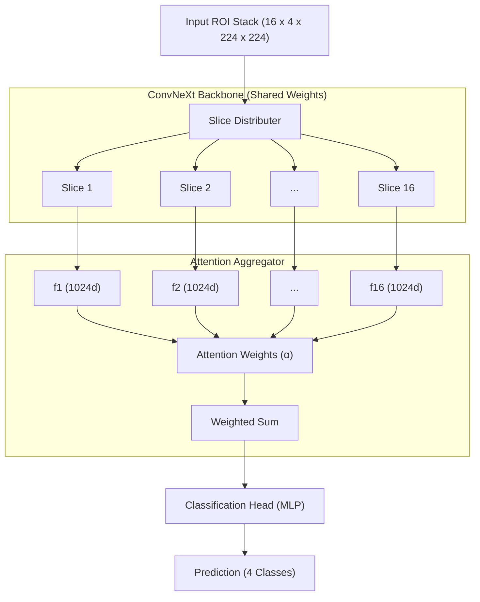

# Classification Architecture: ConvNeXt & 2.5D Fusion

The classification module of **BrainTumorAI** is designed for the differential diagnosis of brain tumors from Region of Interest (ROI) crops. It utilizes a state-of-the-art hybrid architecture that balances 3D context with 2D computational efficiency.

---

## 🏗️ 1. Core Architecture Overview
The system primarily employs a **ConvNeXt** backbone integrated into a **2.5D Multi-Slice Encoder**.

### 1.1 Why 2.5D?
Standard 3D CNNs are computationally expensive and often lack the depth of 2D backbones pretrained on millions of images. The 2.5D approach processes a stack of 2D slices independently and then aggregates their features using a learned attention mechanism, allowing the model to capture inter-slice relationships without the overhead of 3D convolutions.

---

## 🧩 2. Component Breakdown

### 2.1 2D Backbone (Feature Extractor)
*   **Base Model**: `convnext_base` (from the `timm` library).
*   **Pretraining**: Initialized with ImageNet-1K or ImageNet-21K weights.
*   **Adaptation**: The input layer is modified to accept **4 channels** (T1, T1ce, T2, FLAIR) instead of the standard 3 RGB channels.

### 2.2 Multi-Slice Encoder
The encoder processes $N$ slices (default $N=16$) from the 3D tumor ROI.
1.  **Slice Processing**: Each slice $S_i \in \mathbb{R}^{4 \times 224 \times 224}$ is passed through the ConvNeXt backbone.
2.  **Feature Extraction**: Generates a feature vector $f_i \in \mathbb{R}^{1024}$ per slice.
3.  **Aggregation**: A self-attention layer computes an importance weight $\alpha_i$ for each slice:
    $$\text{Aggregated Feature} = \sum_{i=1}^N \alpha_i f_i$$

### 2.3 Classification Head
The aggregated vector passes through a standard MLP head:
*   **Dropout (0.3)**: Prevents overfitting.
*   **Linear Layer**: Reduces dimension to 512.
*   **ReLU Activation**: Introduces non-linearity.
*   **Output Layer**: Produces logits for 4 classes (Glioma, Meningioma, Pituitary, No Tumor).

---

## 📊 3. Data Flow Diagram

---

## ⚙️ 4. Technical Specifications
| Parameter | Value |
| :--- | :--- |
| **Input Shape** | (Batch, 16, 4, 224, 224) |
| **Backbone** | ConvNeXt Base |
| **Total Parameters** | ~89M |
| **Normalization** | LayerNorm (ConvNeXt standard) |
| **Activation** | GELU (Backbone) / ReLU (Head) |

---
*BrainTumorAI Documentation - 2025*
