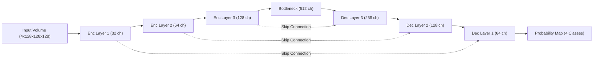

# Segmentation Architecture: Hybrid 3D UNet & SegMamba

The segmentation module of **BrainTumorAI** is responsible for the precise voxel-level localization of tumor sub-regions. The system supports multiple 3D architectures, with the **3D UNet with Residual Units** and **SegMamba** being the primary production models.

---

## 🏗️ 1. Core Architecture: 3D Residual UNet
The primary segmentation engine is an "nnU-Net style" 3D Residual UNet, optimized for dense volumetric prediction.

### 1.1 Encoder-Decoder Structure
*   **Encoder Path**: Progressively downsamples the input volume using strided convolutions while doubling the channel count. This captures high-level semantic context.
*   **Residual Units**: Each layer contains two 3D convolutions with a skip-connection. This allows for deeper networks by mitigating the vanishing gradient problem.
*   **Decoder Path**: Upsamples features back to the original resolution using transposed convolutions, concatenated with encoder skip-connections to recover spatial detail.

---

## 🐍 2. Advanced Architecture: SegMamba (SSM)
For long-range spatial dependencies (crucial for large tumors), the system optionally uses **SegMamba**, which replaces standard Transformer self-attention with **Mamba State-Space Models**.

### 2.1 Why Mamba for Segmentation?
Transformers suffer from quadratic complexity relative to volume size. SegMamba achieves linear scaling, allowing it to process full 3D volumes at high resolution while capturing global anatomical context that standard CNNs might miss.

---

## 🧩 3. Component Details

### 3.1 Input Configuration
*   **Channels**: 4 (T1, T1ce, T2, FLAIR).
*   **Spatial Dims**: 3 (X, Y, Z).
*   **Patch Size**: 128x128x128 (sliding window inference used for larger volumes).

### 3.2 Output Classes (BraTS Convention)
The model outputs a 4-channel probability map:
1.  **Label 0**: Background.
2.  **Label 1**: Necrotic and Non-Enhancing Tumor (NCR).
3.  **Label 2**: Peritumoral Edema (ED).
4.  **Label 3**: Enhancing Tumor (ET).

---

## 📊 4. Data Flow Diagram (UNet Variant)

---

## ⚙️ 5. Technical Specifications
| Parameter | Value |
| :--- | :--- |
| **Channels** | [32, 64, 128, 256, 512] |
| **Normalization** | InstanceNorm3d (Preserves modality-specific intensities) |
| **Activations** | PReLU (Parametric ReLU) |
| **Upsampling** | Transposed Convolutions |
| **Loss Function** | DiceLoss + FocalLoss (Weighted) |

---
*BrainTumorAI Documentation - 2025*
