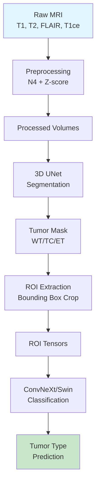

# Neuro-HyMamba Brain Tumor AI System - Implementation Plan

This document outlines the complete implementation plan for a production-ready brain tumor detection system based on the Neuro-HyMamba technical report.

## Overview

The system follows a **Segmentation-then-Classification** workflow:
1. **Preprocessing**: N4 bias correction → Z-score normalization
2. **Segmentation**: 3D UNet produces tumor masks (WT/TC/ET)
3. **ROI Extraction**: Bounding box crop of tumor region
4. **Classification**: ConvNeXt/Swin Transformer predicts tumor type

> [!IMPORTANT]
> **Patient-Level Splitting**: All data splits are strictly patient-level to prevent data leakage. No slice-level mixing allowed.

---

## Proposed Changes

### Core Configuration

#### [NEW] [requirements.txt](file:///Users/arsalan/Documents/GitHub/BrainTumorAI/requirements.txt)
Python dependencies including PyTorch, MONAI, timm, nibabel, SimpleITK, albumentations, wandb.

#### [NEW] [seg.yaml](file:///Users/arsalan/Documents/GitHub/BrainTumorAI/configs/seg.yaml)
Segmentation training configuration: learning rate, batch size, epochs, loss weights, model architecture.

#### [NEW] [cls.yaml](file:///Users/arsalan/Documents/GitHub/BrainTumorAI/configs/cls.yaml)
Classification training configuration: model backbone, optimizer settings, class labels.

---

### Utility Modules

#### [NEW] [seed.py](file:///Users/arsalan/Documents/GitHub/BrainTumorAI/utils/seed.py)
Reproducibility utilities for seeding random, numpy, torch, and CUDA.

#### [NEW] [metrics.py](file:///Users/arsalan/Documents/GitHub/BrainTumorAI/utils/metrics.py)
Evaluation metrics: Dice coefficient, IoU, Accuracy, Precision, Recall, F1-Score, AUC-ROC.

#### [NEW] [logging.py](file:///Users/arsalan/Documents/GitHub/BrainTumorAI/utils/logging.py)
Structured logging utilities with optional W&B integration.

#### [NEW] [io.py](file:///Users/arsalan/Documents/GitHub/BrainTumorAI/utils/io.py)
I/O utilities for loading/saving NIfTI files, patient lists, and checkpoints.

---

### Preprocessing Module

#### [NEW] [n4_bias.py](file:///Users/arsalan/Documents/GitHub/BrainTumorAI/preprocessing/n4_bias.py)
N4ITK bias field correction using SimpleITK.

#### [NEW] [skull_strip.py](file:///Users/arsalan/Documents/GitHub/BrainTumorAI/preprocessing/skull_strip.py)
Skull stripping placeholder (can integrate SynthStrip or HD-BET).

#### [NEW] [normalize.py](file:///Users/arsalan/Documents/GitHub/BrainTumorAI/preprocessing/normalize.py)
Z-score normalization per patient and per modality (non-zero brain voxels only).

#### [NEW] [preprocess_pipeline.py](file:///Users/arsalan/Documents/GitHub/BrainTumorAI/preprocessing/preprocess_pipeline.py)
CLI script orchestrating the full preprocessing pipeline.

---

### Segmentation Module

#### [NEW] [dataset.py](file:///Users/arsalan/Documents/GitHub/BrainTumorAI/segmentation/dataset.py)
3D MRI dataset using MONAI transforms: RandCrop, RandFlip, RandRotate, intensity augmentation.

#### [NEW] [model.py](file:///Users/arsalan/Documents/GitHub/BrainTumorAI/segmentation/model.py)
MONAI 3D UNet (nnU-Net style) with configurable channels and dropout.

#### [NEW] [loss.py](file:///Users/arsalan/Documents/GitHub/BrainTumorAI/segmentation/loss.py)
Combined Dice + Focal loss (DiceFocalLoss from MONAI).

#### [NEW] [train.py](file:///Users/arsalan/Documents/GitHub/BrainTumorAI/segmentation/train.py)
Training script with AMP, checkpoint resume, W&B logging, patient-level validation.

#### [NEW] [infer.py](file:///Users/arsalan/Documents/GitHub/BrainTumorAI/segmentation/infer.py)
Inference script with sliding window inference and mask output.

---

### ROI Extraction Module

#### [NEW] [extract_roi.py](file:///Users/arsalan/Documents/GitHub/BrainTumorAI/roi_extraction/extract_roi.py)
Bounding box extraction from segmentation mask with configurable padding.

---

### Classification Module

#### [NEW] [dataset.py](file:///Users/arsalan/Documents/GitHub/BrainTumorAI/classification/dataset.py)
ROI dataset with slice sampling and 2.5D/3D input options.

#### [NEW] [model.py](file:///Users/arsalan/Documents/GitHub/BrainTumorAI/classification/model.py)
ConvNeXt-V2 or Swin Transformer backbone via timm with custom head.

#### [NEW] [loss.py](file:///Users/arsalan/Documents/GitHub/BrainTumorAI/classification/loss.py)
Focal loss for class imbalance handling.

#### [NEW] [train.py](file:///Users/arsalan/Documents/GitHub/BrainTumorAI/classification/train.py)
Training script with patient-level batching, AMP, early stopping.

#### [NEW] [evaluate.py](file:///Users/arsalan/Documents/GitHub/BrainTumorAI/classification/evaluate.py)
Evaluation script with confusion matrix, classification report, AUC-ROC curves.

---

### Data Splits

#### [NEW] [train.txt](file:///Users/arsalan/Documents/GitHub/BrainTumorAI/data/splits/train.txt)
Sample training patient IDs.

#### [NEW] [val.txt](file:///Users/arsalan/Documents/GitHub/BrainTumorAI/data/splits/val.txt)
Sample validation patient IDs.

#### [NEW] [test.txt](file:///Users/arsalan/Documents/GitHub/BrainTumorAI/data/splits/test.txt)
Sample test patient IDs.

---

### Pipeline Orchestration

#### [NEW] [run_pipeline.sh](file:///Users/arsalan/Documents/GitHub/BrainTumorAI/run_pipeline.sh)
End-to-end execution script covering all stages.

---

### Documentation

#### [NEW] [README.md](file:///Users/arsalan/Documents/GitHub/BrainTumorAI/README.md)
Comprehensive documentation: setup, dataset structure, pipeline execution, GPU requirements.

---

## Verification Plan

### Automated Tests
1. **Unit tests**: Verify each module loads and initializes correctly
2. **Integration test**: Run full pipeline on synthetic data
3. **Split validation**: Assert no patient overlap between train/val/test

### Manual Verification
1. Verify preprocessing outputs visually (check bias correction quality)
2. Validate segmentation masks against ground truth (Dice scores)
3. Confirm classification accuracy on held-out test set

---

## Hardware Requirements

| Component | Requirement |
|-----------|-------------|
| GPU | NVIDIA A10G (24 GB VRAM) |
| Instance | AWS EC2 g5.12xlarge |
| OS | Ubuntu 24.04 |
| CUDA | Pre-installed via Deep Learning AMI |

---

## Architecture Diagram

